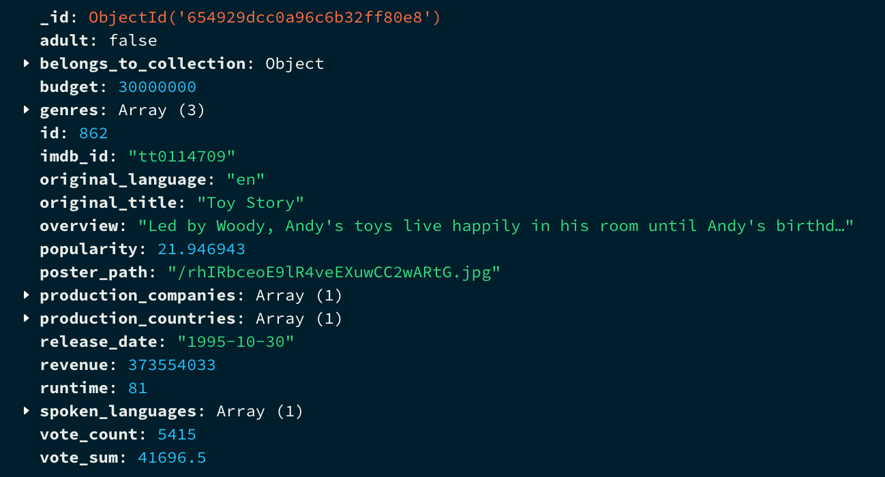
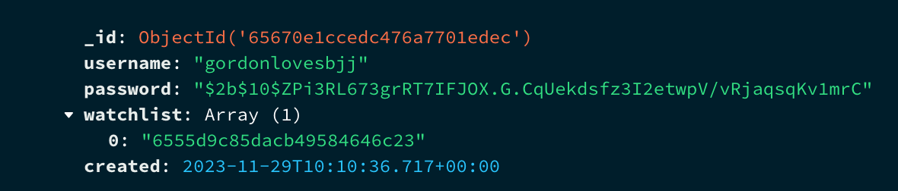
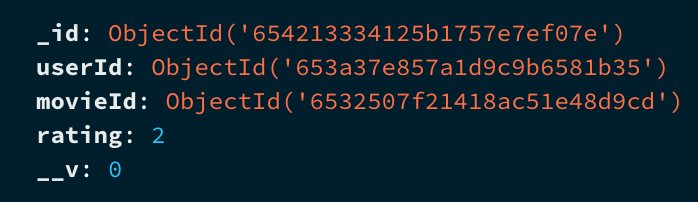

# Revolutionary Movie Database

## Functionality

RMDB gives you the power of a movie database in the palm of your hands. Looking for the next film to watch? Say no more. With our easy and user-friendly interface, you can traverse ratings of movies, old and new.

Here's a peek into what you can do:

1. **Search for a Movie**: Type in your favorite movie's title in our search bar and all related results will be presented.
2. **Filter and sort your searches for Movies**: After typing something in the search bar you can filter the movies on genres such as; horror, adventure, comedy, and much more. These results can also be sorted on rating.
3. **View Movie Details**: Learn more about a movie by clicking on it. From its title, genre, and release date to its runtime, ratings, and a quick overview, we have it all in a neat little card format.
4. **Give a Movie rating**: If you want to show your appreciation or maybe disappointment for a Movie, do so by clicking on the Rate button.
5. **Make a Watchlist**: Are you behind on watching the movies recommended by your friends? Keep an organized list of movies you want to watch with our watchlist.

## How to Get Started?

### Prerequisites

`node` version 20, and `npm` or `bun` are required to run this application. Check your node version by running `node -v` in your terminal.

```
# Start the backend server:
cd backend
npm install
npm run start

# Frontend is in the root folder, just run this:
npm install
npm run dev

# How to run cypress E2E tests in terminal
npm run dev (skip this if the application is running)
npm run cy:run

# How to run Component tests and API tests
cd backend
npm install
cd ..
npm install
npm run test
```

## Dataset

The dataset used for this project was [The Movies Dataset](https://www.kaggle.com/datasets/rounakbanik/the-movies-dataset) found on Kaggle as CVS files. The data was inserted into MongoDB using a python script which also removed documents that had multiple fields with null values.
The choice of this dataset came from the fact that the dataset has a wide range of information about a movie, this allows for many features and functionalities to be implemented. Also it makes it easier to get users engaged becasue movies is a popular form of enterainment with a global audience which will attract many users.

## NEXT UI

Our User Interface is designed using a third-party framework called NEXT UI. NEXT UI provides a variety of pre-made components featuring a modern aesthetic design. These components are responsive across different devices and screen sizes, and they are easy to implement and customize to meet our specific needs. Additionally, NEXT UI incorporates scalability, sustainability, and availability into its design.

## Sustainability and Availibility

Since we are utilizing NEXT UI, a significant amount of sustainability and availability design is already integrated into our UI. Additionally, by using React, our focus has been on maximizing code reuse through modularization and components.

We have also prioritized minimizing backend calls, requesting only the necessary data, for instance, through pagination. In this project, pagination was implemented using Mongoose to improve data retrieval on the backend server. This enhancement was achieved using the 'skip' and 'limit' methods provided by the Mongoose framework.

Furthermore, we have incorporated a dark mode feature with a simple switch. This not only provides a more comfortable visual experience for users but also reduces energy consumption

## MongoDB

The database used for this project is MongoDB which is a NoSQL database. The database is well documented and it has the mongoose framework which makes it easy to work with in combination with Node.Js. For the project there are three different collections called; movies, ratings, and users. The layout of these collections can be seen in the figures below



_Figure 1: Layout of movies collection._



_Figure 2: Layout of users collection._



_Figure 3: Layout of ratings collection._

## Apollo server

Apollo server was chosen for the backend's server because it has a GraphQL integration which is efficient and scalable inside a concise package. It provides an end-to-end GraphQL solution when combined with Apollo client which is also used in this project. The server runs on a VM and can be accessed on this link: [http://it2810-61.idi.ntnu.no:4000](http://it2810-61.idi.ntnu.no:4000)

## E2E testing with Cypress

Cypress is chosen for E2E testing due to its seamless setup, intuitive API, and efficient debugging features. Cypress simplifies the testing process with a straightforward installation process and a user-friendly API that caters to both to all the needs for our application. The real-time test execution and automatic waiting capabilities significantly enhance the productivity of the team by providing immediate feedback during development.

## Vitest

Vitest is used for component testing of the natural reason that Vitest is build on Vite, which our projects is build with. Vitest is fast and effective and in addition offers simple integration with react, offers an isolated testing environment and offers use for mocking and spying functionalities.

## Environment variables

There is one optional environment variable that can be set in the .env file: `VITE_API_URL`, which is used to set the URL for the backend server. If not set, it will automatically run against the backend hosted at IDI: [http://it2810-61.idi.ntnu.no:4000](http://it2810-61.idi.ntnu.no:4000).
